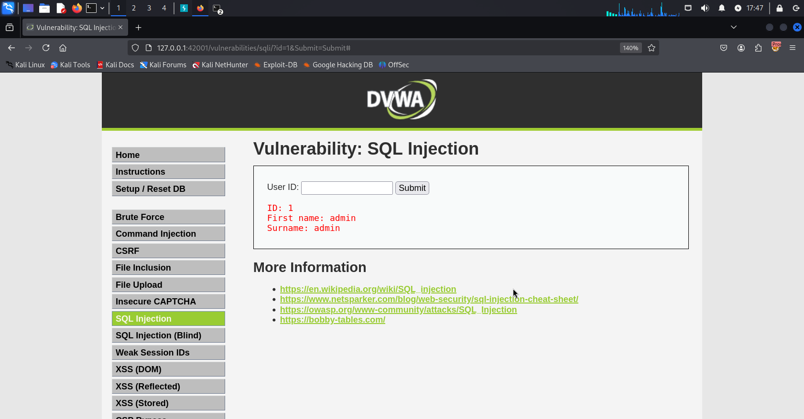
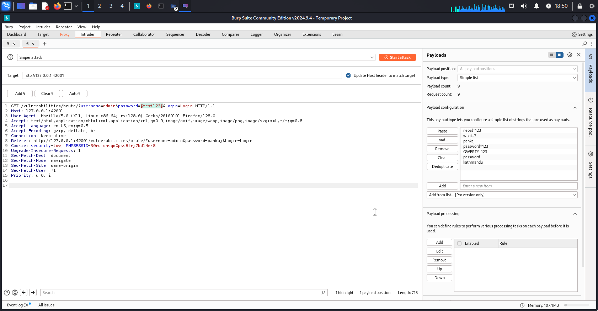
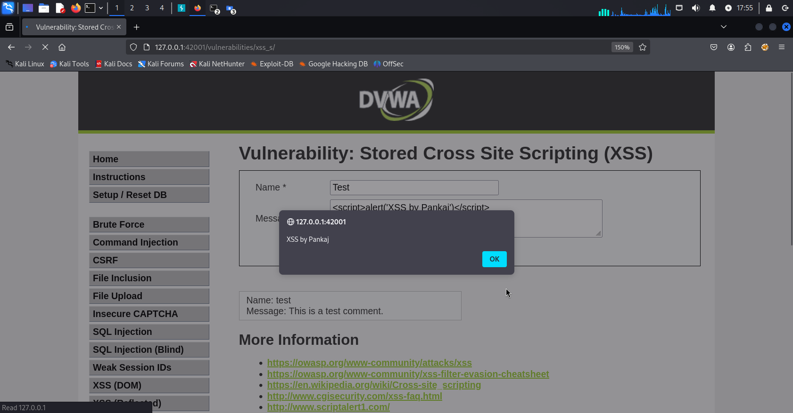
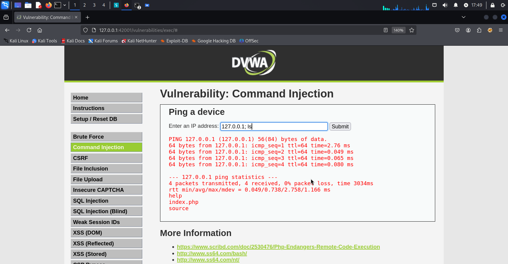

# DVWA Web Attack Practice

This project contains my practical work on common web application vulnerabilities using DVWA (Damn Vulnerable Web Application).

## Tools Used:
- Kali Linux
- Burp Suite
- DVWA (localhost setup)

## Attacks Performed:

| Attack Name        | Description | Screenshot |
|--------------------|-------------|------------|
| SQL Injection      | Bypassing login forms by SQLi attack. |  |
| CSRF Attack        | Exploiting Cross-Site Request Forgery to change password. |  |
| Brute Force Attack | Trying multiple passwords automatically to crack accounts. |  |
| XSS Attack         | Injecting malicious scripts into web applications. |  |
| Command Injection  | Executing system commands via web inputs. |  |

## Learnings:
- Web application vulnerability assessment
- How to detect and exploit common web flaws
- Use of Burp Suite for interception and brute forcing
- Manual testing techniques without automation

---
**Note:** This project is for ethical learning purposes only.  
